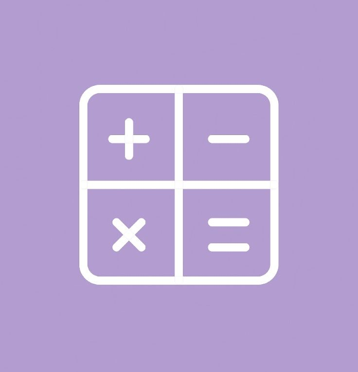
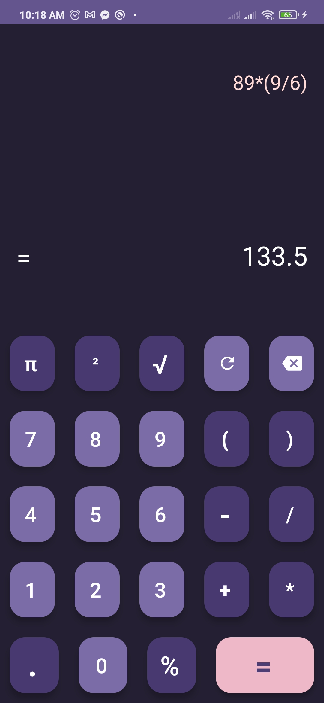
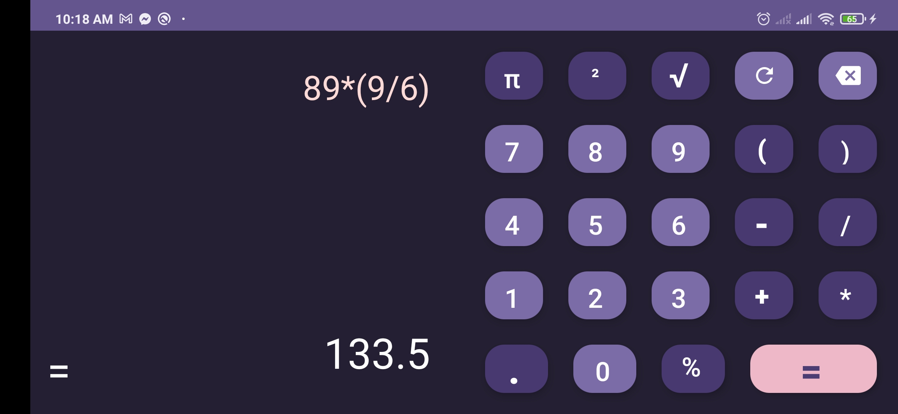

# Calculator App

A modern, user-friendly calculator application for Android with both portrait and landscape modes, designed with a robust ViewModel to handle device rotation seamlessly.

## Screenshots

### App Icon
<p align="center">

</p>

### Get Started Screen
<p align="center">

</p>

### Portrait Mode
<p align="center">

</p>

### Landscape Mode
<p align="center">

</p>

## Features

- **Intuitive User Interface**: Clean and modern design for easy calculation
- **Responsive Layouts**:
  - Fully functional portrait mode
  - Optimized landscape mode for wider screens
- **Comprehensive Calculation Support**:
  - Basic arithmetic operations
  - Responsive button interactions
- **State Preservation**:
  - ViewModel architecture ensures smooth state management during device rotation
- **Modern Design**:
  - Material Design principles
  - Smooth, animated button interactions

## Technical Architecture

### Core Technologies
- **Programming Language**: Kotlin
- **Architecture Pattern**: MVVM (Model-View-ViewModel)
- **UI Framework**: AndroidX
- **State Management**: ViewModel for rotation handling

### Compatibility
- **Minimum SDK Version**: 21
- **Target SDK Version**: 34

### Key Components
- `CalculatorViewModel`: Manages calculation logic and app state
- `MainActivity`: Handles UI rendering and ViewModel interaction
- Custom layout files for portrait and landscape modes

## Installation

### Prerequisites
- Android Studio
- JDK 11 or higher
- Android SDK

### Setup Steps
1. Clone the repository:
   ```bash
   git clone https://github.com/JFRashu/SimpleCalculator
   ```

2. Open the project in Android Studio

3. Sync Gradle files

4. Build and run the application on your preferred emulator or physical device

## ViewModel Rotation Handling

The app uses a ViewModel to preserve calculation state during device rotation. Key benefits include:

- Seamless state preservation
- Preventing unnecessary recalculations
- Maintaining user experience across configuration changes

### Key ViewModel Features
- Expression and result state management
- Support for complex calculations
- Error handling
- Flexible input processing

## Contribution Guidelines

1. Fork the repository
2. Create a feature branch
3. Commit your changes
4. Push to the branch
5. Create a Pull Request

## Troubleshooting

- Ensure you have the latest Android Studio version
- Check Gradle sync and build configurations
- Verify SDK and dependency versions

## Contact

- **Author**: Jannatul Farzana Rashumoni
- **Email**: u2004090@student.cuet.ac.bd
- **GitHub**: [JFRashu](https://github.com/JFRashu)

---

### Future Enhancements
- Scientific calculator mode
- Memory function
- Theme customization
- Accessibility improvements